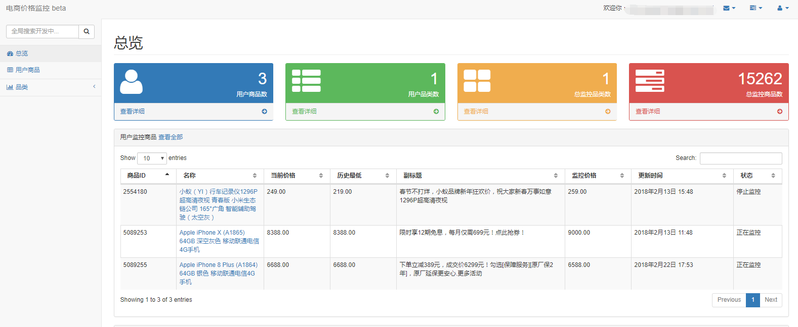
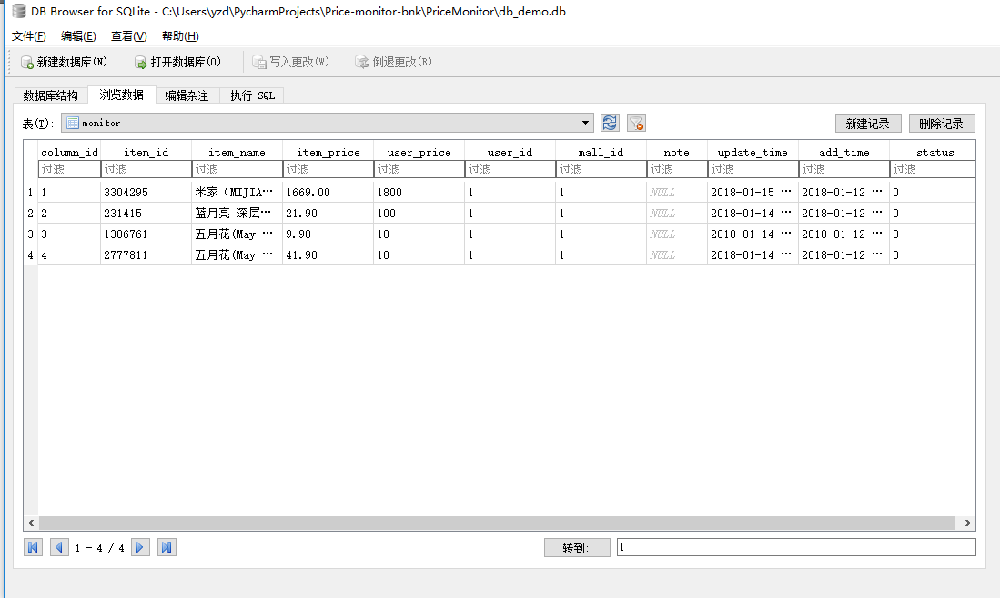

**Price-Monitor:电商价格监控**

**Python3+requests+sqlite+代理池**

[]()[]()

**全新Python3版本：代码重构，采用协程，redis代理池，提高监控效率**

# 简介

**功能：京东商城商品价格监控，用户自行设置商品和预期价格，低于预期价格后自动发送邮件提醒用户抢购。**

**该代码从<a href="https://github.com/qqxx6661/flask_yzd">完整监控系统</a>独立而来，代码量不多，适合给刚接触python爬虫和requests的同学参考。**

**目前已经开放测试：访问<a href="http://www.usau-buy.me/">电商价格监控</a>便可体验。**

网站目前采用的依然是Python2版本的后台监控，正在抓紧更新中。



**申明：该项目只限于爬取网上公开可见的商品信息，请勿用于任何商业使用。**

# TODO List

### 持续更新中

- [x] 代理池重构，单独检验代理对电商网站可达性
- [x] 爬虫采用协程gevent库，提高采集效率
- [ ] 支持更多的代理接口使用，包括：免费代理，付费代理，vps拨号代理
- [ ] 使用Django代替Flask
- [ ] <a href="https://github.com/qqxx6661/Price-monitor/issues/2">商品副标题抓取</a>
- [ ] <a href="https://github.com/qqxx6661/Price-monitor/issues/3">商品历史价格</a>
- [ ] 代码覆盖率测试
- [ ] 支持亚马逊中国，天猫等商城

### 其他功能（欢迎Issue提供意见）

- [ ] <a href="https://github.com/qqxx6661/Price-monitor/issues/1">小说更新监控</a>


# 项目依赖

## python3.5+

主要包含以下库：

- requests
- gevent
- lxml

可以使用项目自带的requirements.txt安装环境

```
pip install -r requirements.txt
```

## sqlite

# 使用步骤

## 0. 运行脚本，新建Sqlite数据库

```
    python PriceMonitor/create_db.py
```

可以使用<a href="http://sqlitebrowser.org/"> sqlitedatabasebrowser</a>查看数据库，添加用户和商品。

也可以通过conn_sql.py里运行现成代码添加用户和商品：

```
    add user named 'test'
    sql.write_user('test', '404013419@qq.com')

    add test item
    sql.write_item(2777811, '10', 1)
```



## 1. 设置邮件提醒的发件邮箱

简易教程请查看：<a href="https://github.com/qqxx6661/Price-monitor/blob/master/docs/SetupEmail.md">设置发件邮箱</a>

## 2. 你可以选择开启代理池抓取（2.1）或者直接使用本地抓取（2.2）


### 2.1开启代理池，采用<a href="https://github.com/ShichaoMa/proxy_factory">proxy_factory</a>基于redis的简单代理工厂，感谢作者ShichaoMa。

启动redis代理池后，修改CONFIG.py的设置：

```
    PROXY_CRAWL = 1
    PROXY_POOL_IP = "127.0.0.1"  # Your redis server ip
```

### 2.2 直接采用本地IP进行监控（注意：请将抓取间隔CRAWL_TIME调大，避免IP被禁，单位：秒）

```
    CRAWL_TIME = 10  # Monitor sleep time, if not using proxy, CRAWL_TIME > 1800 recommended.
    PROXY_CRAWL = 0
    PROXY_POOL_IP = "127.0.0.1"  # Your redis server ip
```

## 3. 运行监控主程序

```
    python Pricemonitor/main.py
```

# 文件结构

- docs:文档

- PriceMonitor

    - CONFIG.py: 常用参数
    
    - create_db.py: 创建数据库

    - conn_sql.py: 数据操作库
    
    - logger.conf: 日志参数
    
    - proxy.py: 代理

    - crawler.py: 爬虫代码

    - main.py: 程序入口

    - mail.py: 邮件模块
    
    - mailbox.txt: 邮箱参数
   
- requirements.txt: 安装依赖

# 老版本

<a href="https://github.com/qqxx6661/Price-Monitor-py2">Python2+requests+sqlite+代理池+Flask(web)</a>

<a href="https://github.com/qqxx6661/Price-monitor-php">Python2+requests+mysql+代理池+Php(web)</a>

# Contribution

- Issue

# Introduction

Monitor price changes for items at JD.com, users could set price for specific item. Once the price is lower than excepted, the server will send an e-mail to user.


