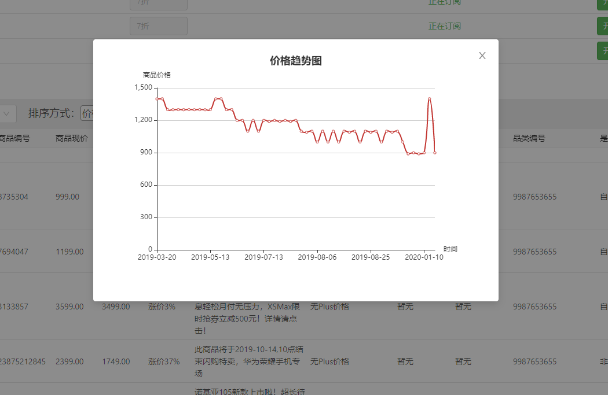

# Price-Monitor

**某东商品价格监控系统**

[]()
[]()
[]()

## 简介

用户自行设定指定商品的监控价格，运行脚本获取价格数据，商品降价到设定价格后发送邮件/微信提醒用户。

主要技术实现：Python爬虫/IP代理池/JS接口爬取/Selenium页面爬取

申明：本脚本没有涉及某东账号登录，没有大批量抓取某东敏感信息，仅抓取商品名称和价格，如有任何敏感问题，请联系我删除。

## README文档导航

1. 若您只想**使用该项目监控某东商品**，请查看：[电商价格监控网站](#电商价格监控网站)
2. 若您想搭建**某东商品页的爬虫代码**，请查看：[核心爬虫代码](#核心爬虫代码)
3. 若您想搭建**某东商品监控项目（爬虫队列+数据存储+邮件提醒）**，请查看：[监控系统搭建](#监控系统搭建)


## 电商价格监控网站<span id="电商价格监控网站"></span>

由该开源**爬虫模块**孵化的项目**电商价格监控**目前已上线运营：

<a href="https://price.monitor4all.cn/">https://price.monitor4all.cn/</a>


**网站实现功能：**

**【功能一】自定义商品监控：设置商品ID和预期价格，当商品价格【低于】设定的预期价格后自动发送邮件/微信提醒用户。**

**【功能二（暂时关闭）】品类商品订阅：用户订阅后，该类降价幅度大于7折的【自营商品】会被选出并发送邮件提醒用户。**

**【功能三】查看某东商品数据和商品价格趋势图**




### 网站架构


**申明：本项目仅限于爬取网上公开可见的商品信息，请勿用于任何商业用途。**

### 该网站页面源码

网站前后端代码暂时未开源，采用的是SpringBoot + React，请关注博客，之后会另开新库开源。

### 网站功能 TODO

- [x] 某东卡券价格，某东精选价格爬取
- [ ] QQ微信第三方登录
- [ ] 会员功能
- [ ] 某东二手商品监控
- [ ] 支持亚马逊中国，天猫，淘宝等商城

### 网站技术 TODO

- [x] 代理池重构，单独检验代理对电商网站可达性
- [x] 支持代理接口：芝麻代理，Tor代理，自行搭建代理池
- [x] <a href="https://github.com/qqxx6661/Price-monitor/issues/2">商品副标题抓取，PLUS会员价格</a>
- [x] <a href="https://github.com/qqxx6661/Price-monitor/issues/3">商品历史价格</a>
- [x] Selenium + Headless Chrome 爬取
- [x] Docker一键部署
- [ ] 支持更多的代理接口：vps拨号代理

### 其他功能 TODO（欢迎Issue提供意见）

- [ ] <a href="https://github.com/qqxx6661/Price-monitor/issues/1">小说更新监控</a>


## 核心爬虫代码

请先使用`pip install -r requirements.txt`安装依赖库

你需要的仅仅只是这两个爬虫类：

- crawler_selenium: (推荐) 使用selenium+chrome访问某东商品单页进行爬取

- crawler_js.py: 使用requests访问某东商品数据接口进行爬取

两个类下方都有测试代码，可以调试，并且都可以接入http/https代理。

**代码里面包括了商品名称，副标题，PLUS价格，历史最高最低价等。**

由于电商经常会更新接口，所以爬虫代码往往具有时效性，若发现代码报错不要慌，自行尝试修改。


### 使用selenium+chrome注意事项

需要安装chrome和chromedriver

若您使用默认的Selenium+Chrome，您还需要安装好Chrome，以及Selenium用来操控Chrome的ChromeDriver。

http://npm.taobao.org/mirrors/chromedriver/

若您在Windows下调试本项目，可以将ChromeDriver放置在任何配置了环境变量的目录下，我放在了C:/Windows/chromedriver.exe

若您使用Js爬取，不需要任何额外的库


## 监控系统搭建

请先使用`pip install -r requirements.txt`安装依赖库

监控系统由如下部分组成：

- 数据库：负责数据的存储
- 爬虫任务队列：
    - 生产者：负责将用户设定的商品加入待爬队列
    - 消费者：收到消息后进行数据的抓取
- 邮件提醒任务队列：
    - 生产者：数据抓取后，与用户设定数据进行对比，需要发送提醒则发送消息
    - 消费者：异步发送提醒邮件

下面我们一步步搭建系统。

### 数据库模块

数据库采用MySQL，Python使用SQLAlchemy连接MySQL，主要涉及文件：

- database/model/*：三张表实体类
- database/sql_operator.py：操作数据库
- CONFIG.py：请在该文件中配置好数据库连接


数据库起名为pricemonitor，你也可以修改数据库名，数据表有三张：

- pm_user：用户信息表
- pm_monitor_item：用户监控商品表
- pm_mail_record：邮件发送记录表

用户表pm_user存储着用户的基础信息，包括邮箱等。pm_monitor_item表则记录着用户监控的商品，其关联了pm_user表的用户Id。pm_mail_record则负责存储每次发邮件的邮件内容，作为归档。该表也可以不用。

这三张表是我运行的[电商监控系统](https://price.monitor4all.cn/)中的三张表，里面有一些对于本项目来说冗余的字段，比如用户密码等，大家可以忽略。

我们可以通过如下给出的sql语句在数据库新建好表，也可以运行database/model/文件夹下三个py文件，通过sqlalchemy反向生成数据表。

```

-- ----------------------------
-- Table structure for pm_mail_record
-- ----------------------------

DROP TABLE IF EXISTS `pm_mail_record`;
CREATE TABLE `pm_mail_record` (
 `id` int(20) unsigned NOT NULL AUTO_INCREMENT COMMENT '主键id',
 `address` varchar(64) NOT NULL COMMENT '邮箱地址',
 `from` varchar(64) NOT NULL COMMENT '发件人昵称',
 `to` varchar(64) NOT NULL COMMENT '收件人昵称',
 `subject` varchar(64) NOT NULL COMMENT '主题',
 `content` varchar(16384) NOT NULL COMMENT '内容',
 `is_sent` tinyint(3) NOT NULL COMMENT '1-发送成功, 0-发送失败',
 `gmt_create` datetime NOT NULL DEFAULT CURRENT_TIMESTAMP COMMENT '创建时间',
 `gmt_modified` datetime NOT NULL DEFAULT CURRENT_TIMESTAMP ON UPDATE CURRENT_TIMESTAMP COMMENT '更新时间',
 PRIMARY KEY (`id`)
) ENGINE=InnoDB DEFAULT CHARSET=utf8 COMMENT='邮件发送记录';

-- ----------------------------
-- Table structure for pm_user
-- ----------------------------
DROP TABLE IF EXISTS `pm_user`;
CREATE TABLE `pm_user` (
  `id` int(11) NOT NULL AUTO_INCREMENT,
  `name` varchar(40) DEFAULT NULL,
  `email` varchar(40) NOT NULL,
  `phone` varchar(20) DEFAULT NULL,
  `password` varchar(255) NOT NULL,
  `is_active` tinyint(1) NOT NULL COMMENT '是否活跃账号',
  `is_superuser` tinyint(1) NOT NULL COMMENT '是否管理员',
  `is_olduser` tinyint(1) DEFAULT '0',
  `gmt_create` datetime NOT NULL DEFAULT CURRENT_TIMESTAMP COMMENT '创建时间',
  `gmt_modified` datetime NOT NULL DEFAULT CURRENT_TIMESTAMP ON UPDATE CURRENT_TIMESTAMP COMMENT '更新时间',
  PRIMARY KEY (`id`),
  UNIQUE KEY `uk_email` (`email`)
) ENGINE=InnoDB DEFAULT CHARSET=utf8;

-- ----------------------------
-- Table structure for pm_monitor_item
-- ----------------------------
DROP TABLE IF EXISTS `pm_monitor_item`;
CREATE TABLE `pm_monitor_item` (
  `id` int(11) NOT NULL AUTO_INCREMENT,
  `user_id` int(11) NOT NULL,
  `user_price` varchar(10) NOT NULL,
  `item_id` bigint(20) NOT NULL,
  `category_id` bigint(20) DEFAULT NULL,
  `name` varchar(256) DEFAULT NULL,
  `subtitle` varchar(512) DEFAULT NULL,
  `price` varchar(32) DEFAULT NULL,
  `plus_price` varchar(32) DEFAULT NULL,
  `max_price` varchar(32) DEFAULT NULL,
  `min_price` varchar(32) DEFAULT NULL,
  `discount` varchar(32) DEFAULT NULL,
  `last_price` varchar(32) DEFAULT NULL,
  `note` varchar(128) DEFAULT NULL COMMENT '备注（保留字段）',
  `sale` varchar(128) DEFAULT NULL,
  `label` varchar(128) DEFAULT NULL,
  `store_name` varchar(128) DEFAULT NULL,
  `is_ziying` tinyint(1) DEFAULT NULL COMMENT '是否自营',
  `is_alert` tinyint(1) NOT NULL COMMENT '是否已经提醒',
  `gmt_create` datetime NOT NULL DEFAULT CURRENT_TIMESTAMP COMMENT '创建时间',
  `gmt_modified` datetime NOT NULL DEFAULT CURRENT_TIMESTAMP ON UPDATE CURRENT_TIMESTAMP COMMENT '更新时间',
  PRIMARY KEY (`id`)
) ENGINE=InnoDB DEFAULT CHARSET=utf8;
```

生成好数据表后，我们首先向pm_user插入一个用户记录：

```
INSERT INTO `pricemonitor`.`pm_user` (`name`, `email`, `password`, `is_active`, `is_superuser`) VALUES ('user01', 'xxxxxxxx@foxmail.com', 'xxxxx', '1', '1');
```

重要字段：

- 用户id = 1
- 邮箱email = xxxxxxxx@foxmail.com

接着，我们向pm_monitor_item表插入一个监控记录，监控iPhone11（JD对应商品id为：100008348542）

```
INSERT INTO `pricemonitor`.`pm_monitor_item` (`user_id`, `user_price`, `item_id`, `is_alert`) VALUES ('1', '6000.00', '100008348542', '1');
```

重要字段：

- user_id：对应pm_user的主键id
- user_price：用户设定的价格，这里我们设置为6000元，一旦低于6000元，就会发送提醒
- item_id：商品id
- is_alert：是否提醒，一旦发送了提醒邮件，就将其置为0，防止重复发送邮件


### 爬虫任务队列/邮件提醒任务队列

任务队列使用RabbitMQ消息队列，需要先安装RabbitMQ，请自行安装。

项目中使用依赖库Pika连接RabbitMQ。

#### 邮件提醒任务队列


我们需要设置邮件提醒的发件邮箱：

简易教程请查看：<a href="https://github.com/qqxx6661/Price-monitor/blob/master/docs/SetupEmail.md">设置发件邮箱</a>

邮件提醒任务队列相关代码：

- consumer_mail.py：邮件发送队列消费者
- producer_mail.py：邮件发送队列生产者
- mailbox.txt: 邮箱参数设置
- mail.py: 邮件发送工具类

运行consumer_mail开启消费者监听，监听消息队列传来的待爬消息：

```
.....
.....
2020-01-15 17:42:58 | INFO | consumer_mail.py 25 | 开始监听Queue：mail
```

这样就启动了发送邮件的监听，一旦爬虫任务队列发现需要发送提醒邮件给用户，则会向该队列发送一条消息。

你可以运行一次producer_mail.py来向消息队列推送一次测试邮件，别忘了将producer_mail.py中的接收者邮箱address改为你自己的实际邮箱

```
data = {'subject': "【主题】", 'address': "xxxxxxxx@foxmail.com", 'msg': "内容", 'from': "发送者", 'to': "接收者", "id": 1}
```


#### 爬虫任务队列

紧接着，我们需要开启爬虫的消费者。

爬虫任务队列相关代码：

- consumer_jd_crawl.py：爬虫任务队列消费者
- producer_jd_crawl.py：爬虫任务队列生产者


运行consumer_jd_crawl开启消费者监听，监听消息队列传来的待爬消息：

```
.....
.....
2020-01-15 17:18:14 | INFO | consumer_jd_crawl.py 30 | 开始监听Queue：jd_crawl
```

**到了这里，你已经大功告成了。**

你可以运行一次producer_jd_crawl.py，来手动向待爬队列推送一次爬虫请求。

在producer_jd_crawl.py中，我们向消费者推送了一条商品Id为100008348542，记录为pm_monitor_item中id=1的记录数据，消费者会去爬取该商品，得到商品价格，存储表中，并与用户设置的价格对比，若小于用户设定的价格（或者在用户设定的价格基础上打了DISCOUNT_LIMIT=0.7（7折）），则会向邮件队列发送消息，发送待爬邮件。
在实际应用中,你可以通过各种方式向爬虫队列推送数据，甚至可以改造producer_jd_crawl.py来实现推送。

下面给出一次完整的消费队列日志：


```
2020-01-15 17:51:25 | INFO | connection_workflow.py 179 | Pika version 1.1.0 connecting to ('::1', 5672, 0, 0)
2020-01-15 17:51:25 | INFO | io_services_utils.py 345 | Socket connected: <socket.socket fd=912, family=AddressFamily.AF_INET6, type=SocketKind.SOCK_STREAM, proto=6, laddr=('::1', 54510, 0, 0), raddr=('::1', 5672, 0, 0)>
2020-01-15 17:51:25 | INFO | connection_workflow.py 428 | Streaming transport linked up: (<pika.adapters.utils.io_services_utils._AsyncPlaintextTransport object at 0x03CCF350>, _StreamingProtocolShim: <SelectConnection PROTOCOL transport=<pika.adapters.utils.io_services_utils._AsyncPlaintextTransport object at 0x03CCF350> params=<ConnectionParameters host=localhost port=5672 virtual_host=/ ssl=False>>).
2020-01-15 17:51:25 | INFO | connection_workflow.py 293 | AMQPConnector - reporting success: <SelectConnection OPEN transport=<pika.adapters.utils.io_services_utils._AsyncPlaintextTransport object at 0x03CCF350> params=<ConnectionParameters host=localhost port=5672 virtual_host=/ ssl=False>>
2020-01-15 17:51:25 | INFO | connection_workflow.py 725 | AMQPConnectionWorkflow - reporting success: <SelectConnection OPEN transport=<pika.adapters.utils.io_services_utils._AsyncPlaintextTransport object at 0x03CCF350> params=<ConnectionParameters host=localhost port=5672 virtual_host=/ ssl=False>>
2020-01-15 17:51:25 | INFO | blocking_connection.py 453 | Connection workflow succeeded: <SelectConnection OPEN transport=<pika.adapters.utils.io_services_utils._AsyncPlaintextTransport object at 0x03CCF350> params=<ConnectionParameters host=localhost port=5672 virtual_host=/ ssl=False>>
2020-01-15 17:51:25 | INFO | blocking_connection.py 1247 | Created channel=1
2020-01-15 17:51:25 | INFO | consumer_jd_crawl.py 30 | 开始监听Queue：jd_crawl
2020-01-15 17:51:31 | INFO | consumer_jd_crawl.py 34 | 收到消息: b'{"id": "1", "item_id": "100008348542"}' 序号为：1
2020-01-15 17:51:31 | INFO | consumer_jd_crawl.py 38 | 线程开始处理消息： b'{"id": "1", "item_id": "100008348542"}' 序号为：1
2020-01-15 17:51:31 | INFO | consumer_jd_crawl.py 67 | 开始爬取：{'id': '1', 'item_id': '100008348542'}
2020-01-15 17:51:35 | INFO | crawler_selenium.py 46 | Crawl: https://item.jd.com/100008348542.html
2020-01-15 17:51:36 | INFO | crawler_selenium.py 61 | 价格元素未出现
2020-01-15 17:51:38 | INFO | crawler_selenium.py 53 | 爬取价格数据
2020-01-15 17:51:38 | INFO | crawler_selenium.py 54 | Found price element: 5999.00
2020-01-15 17:51:38 | INFO | crawler_selenium.py 120 | Crawl SUCCESS: {'name': 'Apple iPhone 11 (A2223) 128GB 黑色 移动联通电信4G手机 双卡双待', 'price': '5999.00', 'plus_price': None, 'subtitle': '【年货节抢购攻略】iPhone11Pro系列抢券享12期免息轻松月付无压力，XSMax限时抢券立减500元！更多优惠点击！'}
2020-01-15 17:51:48 | INFO | crawler_selenium.py 137 | huihui body元素出现，内容未出现重试2秒
2020-01-15 17:51:50 | INFO | crawler_selenium.py 137 | huihui body元素出现，内容未出现重试2秒
2020-01-15 17:51:52 | INFO | crawler_selenium.py 137 | huihui body元素出现，内容未出现重试2秒
2020-01-15 17:51:54 | INFO | crawler_selenium.py 137 | huihui body元素出现，内容未出现重试2秒
2020-01-15 17:51:56 | INFO | crawler_selenium.py 137 | huihui body元素出现，内容未出现重试2秒
2020-01-15 17:51:58 | INFO | crawler_selenium.py 137 | huihui body元素出现，内容未出现重试2秒
2020-01-15 17:52:00 | INFO | crawler_selenium.py 137 | huihui body元素出现，内容未出现重试2秒
2020-01-15 17:52:02 | INFO | crawler_selenium.py 137 | huihui body元素出现，内容未出现重试2秒
2020-01-15 17:52:04 | INFO | crawler_selenium.py 137 | huihui body元素出现，内容未出现重试2秒
2020-01-15 17:52:06 | INFO | crawler_selenium.py 137 | huihui body元素出现，内容未出现重试2秒
2020-01-15 17:52:08 | INFO | crawler_selenium.py 137 | huihui body元素出现，内容未出现重试2秒
2020-01-15 17:52:10 | INFO | crawler_selenium.py 137 | huihui body元素出现，内容未出现重试2秒
2020-01-15 17:52:12 | INFO | crawler_selenium.py 137 | huihui body元素出现，内容未出现重试2秒
2020-01-15 17:52:14 | INFO | crawler_selenium.py 137 | huihui body元素出现，内容未出现重试2秒
2020-01-15 17:52:16 | WARNING | crawler_selenium.py 151 | Crawl failure: Expecting value
2020-01-15 17:52:19 | INFO | consumer_jd_crawl.py 71 | 爬虫执行时间: 47.987872838974
2020-01-15 17:52:19 | INFO | sql_operator.py 31 | 更新某东商品数据开始：{'id': '1', 'item_id': '100008348542'} {'name': 'Apple iPhone 11 (A2223) 128GB 黑色 移动联通电信4G手机 双卡双待', 'price': '5999.00', 'plus_price': None, 'subtitle': '【年货节抢购攻略】iPhone11Pro系列抢券享12期免息轻松月付无压力，XSMax限时抢券立减500元！更多优惠点击！'}
2020-01-15 17:52:19 | INFO | sql_operator.py 53 | 更新某东商品数据完成
2020-01-15 17:52:19 | INFO | sql_operator.py 59 | 查询表记录Id：1 是否需要邮件提醒
2020-01-15 17:52:19 | INFO | consumer_jd_crawl.py 53 | 需要发送邮件提醒，pm_monitor_id：[1]
2020-01-15 17:52:19 | INFO | sql_operator.py 107 | 查用户表获取信息：1
2020-01-15 17:52:19 | INFO | sql_operator.py 113 | user_id：1
2020-01-15 17:52:19 | INFO | sql_operator.py 121 | name：user01
2020-01-15 17:52:19 | INFO | sql_operator.py 122 | email：xxxxxxxx@foxmail.com
2020-01-15 17:52:19 | INFO | consumer_jd_crawl.py 79 | 开始撰写提醒邮件内容
2020-01-15 17:52:19 | INFO | connection_workflow.py 179 | Pika version 1.1.0 connecting to ('::1', 5672, 0, 0)
2020-01-15 17:52:19 | INFO | io_services_utils.py 345 | Socket connected: <socket.socket fd=1000, family=AddressFamily.AF_INET6, type=SocketKind.SOCK_STREAM, proto=6, laddr=('::1', 54639, 0, 0), raddr=('::1', 5672, 0, 0)>
2020-01-15 17:52:19 | INFO | connection_workflow.py 428 | Streaming transport linked up: (<pika.adapters.utils.io_services_utils._AsyncPlaintextTransport object at 0x0422B4D0>, _StreamingProtocolShim: <SelectConnection PROTOCOL transport=<pika.adapters.utils.io_services_utils._AsyncPlaintextTransport object at 0x0422B4D0> params=<ConnectionParameters host=localhost port=5672 virtual_host=/ ssl=False>>).
2020-01-15 17:52:19 | INFO | connection_workflow.py 293 | AMQPConnector - reporting success: <SelectConnection OPEN transport=<pika.adapters.utils.io_services_utils._AsyncPlaintextTransport object at 0x0422B4D0> params=<ConnectionParameters host=localhost port=5672 virtual_host=/ ssl=False>>
2020-01-15 17:52:19 | INFO | connection_workflow.py 725 | AMQPConnectionWorkflow - reporting success: <SelectConnection OPEN transport=<pika.adapters.utils.io_services_utils._AsyncPlaintextTransport object at 0x0422B4D0> params=<ConnectionParameters host=localhost port=5672 virtual_host=/ ssl=False>>
2020-01-15 17:52:19 | INFO | blocking_connection.py 453 | Connection workflow succeeded: <SelectConnection OPEN transport=<pika.adapters.utils.io_services_utils._AsyncPlaintextTransport object at 0x0422B4D0> params=<ConnectionParameters host=localhost port=5672 virtual_host=/ ssl=False>>
2020-01-15 17:52:19 | INFO | blocking_connection.py 1247 | Created channel=1
2020-01-15 17:52:19 | INFO | blocking_connection.py 788 | Closing connection (200): Normal shutdown
2020-01-15 17:52:19 | INFO | channel.py 534 | Closing channel (200): 'Normal shutdown' on <Channel number=1 OPEN conn=<SelectConnection OPEN transport=<pika.adapters.utils.io_services_utils._AsyncPlaintextTransport object at 0x0422B4D0> params=<ConnectionParameters host=localhost port=5672 virtual_host=/ ssl=False>>>
2020-01-15 17:52:19 | INFO | channel.py 1119 | Received <Channel.CloseOk> on <Channel number=1 CLOSING conn=<SelectConnection OPEN transport=<pika.adapters.utils.io_services_utils._AsyncPlaintextTransport object at 0x0422B4D0> params=<ConnectionParameters host=localhost port=5672 virtual_host=/ ssl=False>>>
2020-01-15 17:52:19 | INFO | connection.py 1295 | Closing connection (200): 'Normal shutdown'
2020-01-15 17:52:19 | INFO | io_services_utils.py 732 | Aborting transport connection: state=1; <socket.socket fd=1000, family=AddressFamily.AF_INET6, type=SocketKind.SOCK_STREAM, proto=6, laddr=('::1', 54639, 0, 0), raddr=('::1', 5672, 0, 0)>
2020-01-15 17:52:19 | INFO | io_services_utils.py 907 | _AsyncTransportBase._initate_abort(): Initiating abrupt asynchronous transport shutdown: state=1; error=None; <socket.socket fd=1000, family=AddressFamily.AF_INET6, type=SocketKind.SOCK_STREAM, proto=6, laddr=('::1', 54639, 0, 0), raddr=('::1', 5672, 0, 0)>
2020-01-15 17:52:19 | INFO | io_services_utils.py 870 | Deactivating transport: state=1; <socket.socket fd=1000, family=AddressFamily.AF_INET6, type=SocketKind.SOCK_STREAM, proto=6, laddr=('::1', 54639, 0, 0), raddr=('::1', 5672, 0, 0)>
2020-01-15 17:52:19 | INFO | connection.py 1999 | AMQP stack terminated, failed to connect, or aborted: opened=True, error-arg=None; pending-error=ConnectionClosedByClient: (200) 'Normal shutdown'
2020-01-15 17:52:19 | INFO | connection.py 2065 | Stack terminated due to ConnectionClosedByClient: (200) 'Normal shutdown'
2020-01-15 17:52:19 | INFO | io_services_utils.py 883 | Closing transport socket and unlinking: state=3; <socket.socket fd=1000, family=AddressFamily.AF_INET6, type=SocketKind.SOCK_STREAM, proto=6, laddr=('::1', 54639, 0, 0), raddr=('::1', 5672, 0, 0)>
2020-01-15 17:52:19 | INFO | blocking_connection.py 525 | User-initiated close: result=BlockingConnection__OnClosedArgs(connection=<SelectConnection CLOSED transport=None params=<ConnectionParameters host=localhost port=5672 virtual_host=/ ssl=False>>, error=ConnectionClosedByClient: (200) 'Normal shutdown')
2020-01-15 17:52:19 | INFO | consumer_jd_crawl.py 106 | 提醒邮件已经发送进队列
2020-01-15 17:52:19 | INFO | consumer_jd_crawl.py 60 | 消息处理完成，发送确认序号： 1
```

## 文件结构

- docs:文档
- PriceMonitor
    - database/model/*：三张表实体类
    - database/sql_operator.py：操作数据库
    - CONFIG.py: 常用参数设置
    - proxy.py: 代理IP获取
    - crawler_selenium：Selenium爬虫（默认）
    - crawler_js.py: JS爬虫
    - mailbox.txt: 邮箱参数设置
    - mail.py: 邮件发送工具类
    - consumer_jd_crawl.py：爬虫任务队列消费者
    - producer_jd_crawl.py：爬虫任务队列生产者
    - consumer_mail.py：邮件发送队列消费者
    - producer_mail.py：邮件发送队列生产者
- requirements.txt: 安装依赖


## 老版本

- <a href="https://github.com/qqxx6661/Price-Monitor-py2">Python2+requests+sqlite+代理池+Flask前后端</a>

- <a href="https://github.com/qqxx6661/Price-monitor-php">Python2+requests+mysql+代理池+Php前后端</a>

## Contribution

- Issue, Pull Request

## Introduction

This open-source code focuses on monitoring price changes at JD.com, users could set expect price for specific item. 

Once the price is lower than excepted, the server will send an e-mail to user.

If you are interested in it, feel free to contract yangzd1993@foxmail.com

## 找到我

- **微信公众号：后端技术漫谈**
- CSDN：[@后端技术漫谈](http://blog.csdn.net/qqxx6661)
- 知乎：[@后端技术漫谈](https://www.zhihu.com/people/yang-zhen-dong-1/)
- 简书：[@后端技术漫谈](https://www.jianshu.com/u/b5f225ca2376)
- 掘金：[@后端技术漫谈](https://juejin.im/user/5b48015ce51d45191462ba55)

