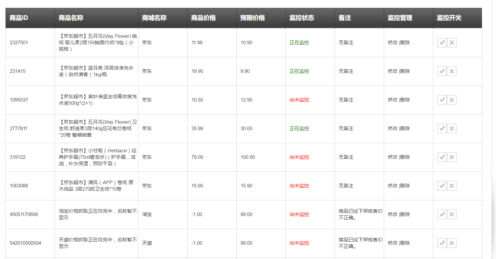

Price-Monitor:电商价格监控

Python3+requests+sqlite+代理池
==========

**全新版本来袭：代码完全重构，采用协程，redis代理池，大大提高监控效率**

# 简介

**功能：京东商城商品价格监控，用户自行设置商品和预期价格，低于预期价格后自动发送邮件提醒用户抢购。**

**该代码从<a href="https://github.com/qqxx6661/flask_yzd">完整监控系统</a>独立而来，由于其代码量很少，适合给刚接触python爬虫和requests的同学参考。**

**目前已经开放测试：访问<a href="http://www.usau-buy.me/">电商价格监控</a>便可体验。**



**申明：该项目只限于爬取网上公开可见的商品信息，请勿用于任何商业使用。**

# TODO List

## 持续更新中

- [x] 代理池重构，单独检验代理对电商网站可达性
- [x] 爬虫采用协程gevent库，提高采集效率
- [ ] 支持更多的代理接口使用，包括：免费代理，付费代理，vps拨号代理
- [ ] 代码覆盖率测试
- [ ] 支持亚马逊中国，天猫等商城


# 项目依赖

## python3.5+

主要包含以下库：

- requests
- gevent
- lxml

可以使用项目自带的requirements.txt安装环境

```
pip install -r requirements.txt
```

## sqlite

# 使用步骤

0. 运行脚本，新建Sqlite数据库

```
    python PriceMonitor/create_db.py
```

可以使用<a href="http://sqlitebrowser.org/"> sqlitedatabasebrowser</a>查看数据库。

1. 设置邮件提醒的发件邮箱

教程请查看：<a href="https://github.com/qqxx6661/Price-monitor/blob/master/docs/SetupEmail.md">设置发件邮箱</a>

2. 开启Proxypool代理池，开始爬取代理ip

```
    python Proxypool/proxypool.py
```
3. 运行监控主程序

```
    python Pricemonitor/main.py
```

# 文件结构

- ProxyPool:代理池，防止被封<a href="https://github.com/Greyh4t/ProxyPool">原作者项目地址</a>

- PriceMonitor

    - additemcrawl.py: 添加商品立即抓取（单次抓取）

    - conn_sql.py: 连接数据库

    - crawl.py: 爬虫核心代码

    - main.py: 程序入口

    - send_email.py: 邮件提醒模块


# Introduction

monitor price changes in JD.com, users can set expected price of specific item. Once the price is lower than excepted, the server will send an e-mail to user.


