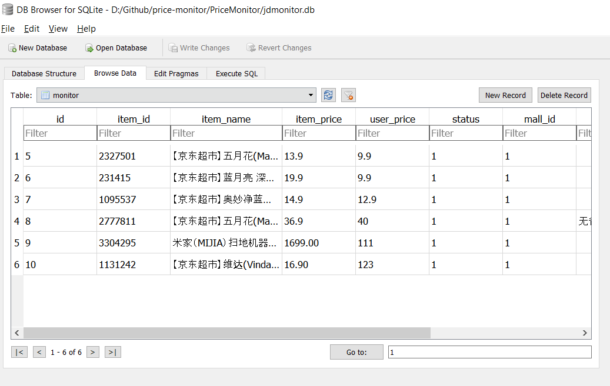

price-monitor
==========

# 简介

**该项目为电商价格监控-爬虫代码，可独立使用**

**功能：京东商城商品价格监控，用户自行设置商品和预期价格，低于预期价格后自动发送邮件提醒用户抢购。**

**基于Flask的完整监控系统项目地址：<a href="https://github.com/qqxx6661/flask_yzd">点我</a>**

**目前已经开放（新版）测试：访问<a href="http://www.usau-buy.me/">电商价格监控系统</a>便可体验。**


**申明：该项目只限于爬取网上公开可见的商品信息。**

# 项目依赖

1. python2.7
- requests
- gevent(代理池依赖)
- lxml
- beautifulsoup4

2. sqlite

# 使用步骤

**该代码从<a href="https://github.com/qqxx6661/flask_yzd">完整监控系统</a>独立而来，由于其代码量很少，适合给刚接触python爬虫和requests的同学参考。**

0. 项目提供了数据库文件jdmonitor.db，里面有一些测试的商品条目，也可以自行添加。
可以使用<a href="http://sqlitebrowser.org/"> sqlitedatabasebrowser</a>
打开数据库添加条目。
例如：
```
item_id = 1131242 (商品ID)
user_price = 100 (期望价格)
status = 1 (监控开关)
mall_id = 1 (代表京东)
user_id = 1 (网站用，这里请直接填写1)
```



1. 设置邮件提醒的发件邮箱

在PriceMonitor文件夹下有mailbox.txt，请自行设置邮箱，大部分邮箱都支持，比如QQ，gamil，校园邮箱，网易等

- 第一行为发送邮箱地址
- 第二行为发送邮箱密码
- 第三行为邮箱的stmp


```
        xxxxxxxxx@xxx.edu.cn  
        xxxxxxxx
        stmp.xxx.edu.cn
```

2. 开启Proxypool代理池，开始爬取代理ip

```
    python Proxypool/proxypool.py
```
3. 运行监控主程序

```
    python Pricemonitor/main.py
```

# 文件结构

- ProxyPool:代理池，防止被封<a href="https://github.com/Greyh4t/ProxyPool">原作者项目地址</a>

- PriceMonitor

    - additemcrawl.py: 添加商品立即抓取（单次抓取）

    - conn_sql.py: 连接数据库

    - crawl.py: 爬虫核心代码

    - main.py: 程序入口

    - send_email.py: 邮件提醒模块


# Introduction

monitor price changes in JD.com, users can set expected price of specific item. Once the price is lower than excepted, the server will send an e-mail to user.


