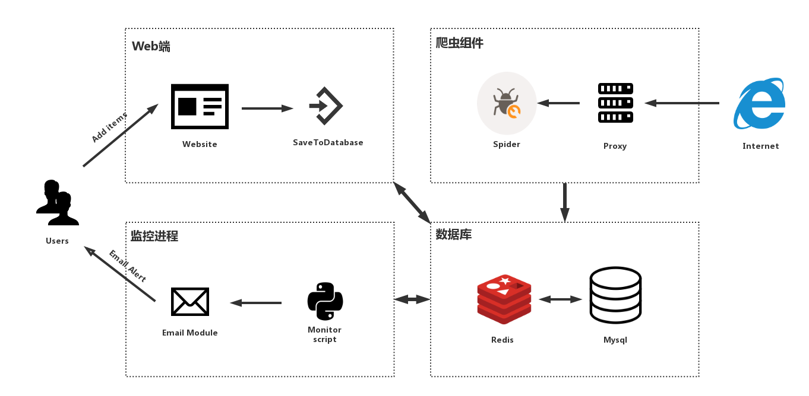
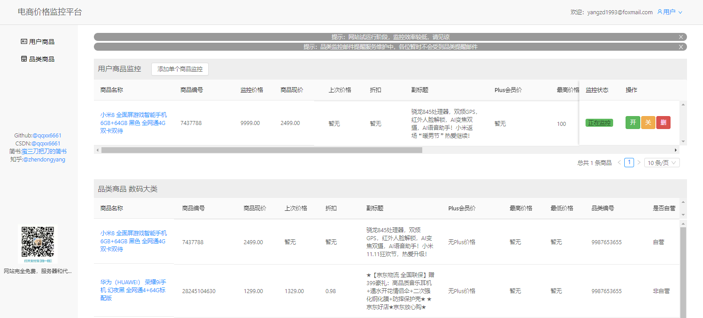
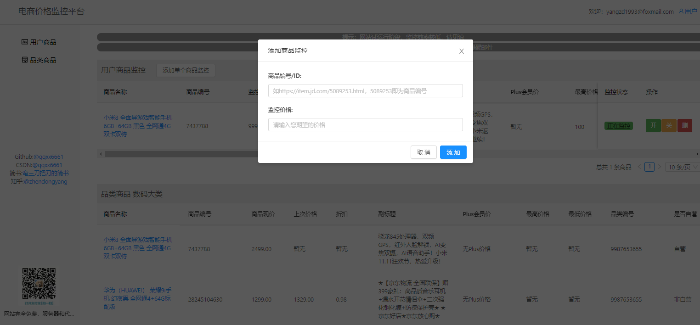
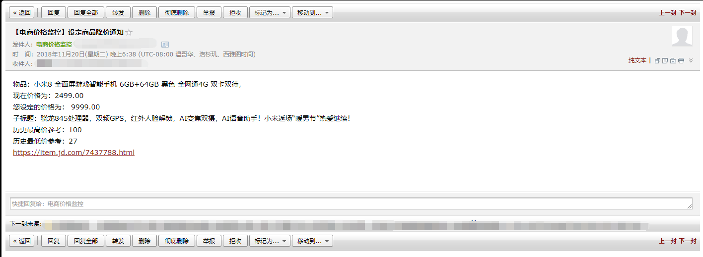

**Price-Monitor:电商价格监控**

**Python3+Requests/Selenium+Sqlite/Mysql+免费代理池/代理接口**

[]()
[]()
[]()
[]()

**目前网站已开放：访问电商价格监控平台：<a href="https://pricemonitor.online/">https://pricemonitor.online/</a>便可体验。**

# 简介

**实现功能：**

**【功能一】自定义商品监控：设置商品ID和预期价格，当商品价格【低于】设定的预期价格后自动发送邮件提醒用户。**

**【功能二】品类商品订阅：用户订阅后，该类降价幅度大于7折的【自营商品】会被选出并发送邮件提醒用户。**










**申明：本项目仅限于爬取网上公开可见的商品信息，请勿用于任何商业用途。**

## 关于网站

该库开源的是爬虫代码，网站前后端代码暂时未开源，网页采用Springboot+React编写，请关注我的博客，之后会另开新库开放网站源代码。

# 最近更新

- Selenium + Headless Chrome爬取
- 商品副标题/商品历史价格抓取
- 增加对Mysql数据库支持

# TODO List

**持续更新中**

- [x] 代理池重构，单独检验代理对电商网站可达性
- [x] 爬虫采用协程库，提高采集效率
- [x] 支持更多的代理接口：免费代理，付费代理，vps拨号代理
- [x] 使用Springboot代替Django作为网站后台
- [x] <a href="https://github.com/qqxx6661/Price-monitor/issues/2">商品副标题抓取，PLUS会员价格</a>
- [x] <a href="https://github.com/qqxx6661/Price-monitor/issues/3">商品历史价格</a>
- [x] Selenium + PhantomJS/Headless Chrome 爬取
- [ ] 更方便的添加监控商品：正则匹配商品编号
- [ ] Docker一键部署（即将更新）
- [ ] 支持亚马逊中国，天猫，淘宝等商城


### 其他功能（欢迎Issue提供意见）

- [ ] <a href="https://github.com/qqxx6661/Price-monitor/issues/1">小说更新监控</a>


# 项目依赖

## python3.5+

主要包含以下库：

- requests
- gevent
- lxml
- selenium(可选)

可以使用项目自带的requirements.txt安装环境

```
pip install -r requirements.txt
```


# 使用步骤

## 0. 运行脚本，新建Sqlite数据库

```
    python PriceMonitor/create_db.py
```

可以使用<a href="http://sqlitebrowser.org/"> sqlitedatabasebrowser</a>查看数据库，添加用户和商品。

也可以通过conn_sql.py里运行现成代码添加用户和商品：

```
    add user named 'test'
    sql.write_user('test', '404013419@qq.com')

    add test item
    sql.write_item(2777811, '10', 1)
```


## 1. 设置邮件提醒的发件邮箱

简易教程请查看：<a href="https://github.com/qqxx6661/Price-monitor/blob/master/docs/SetupEmail.md">设置发件邮箱</a>

## 2. 你可以选择开启代理池抓取（2.1）或者直接使用本地抓取（2.2）


### 2.1 开启代理池，采用<a href="https://github.com/ShichaoMa/proxy_factory">proxy_factory</a>基于redis的简单代理工厂，感谢作者ShichaoMa。

启动redis代理池后，修改CONFIG.py的设置：

```
    PROXY_CRAWL = 1
    PROXY_POOL_IP = "127.0.0.1"  # Your redis server ip
```

### 2.2 直接采用本地IP进行监控（注意：请将抓取间隔CRAWL_TIME调大，避免IP被禁，单位：秒）

```
    CRAWL_TIME = 10  # Monitor sleep time, if not using proxy, CRAWL_TIME > 1800 recommended.
    PROXY_CRAWL = 0
    PROXY_POOL_IP = "127.0.0.1"  # Your redis server ip
```

## 3. 运行监控主程序

```
    python Pricemonitor/main.py
```

# 文件结构

- docs:文档

- PriceMonitor

    - CONFIG.py: 常用参数
    
    - create_db.py: 创建数据库

    - conn_sql.py: 数据操作库
    
    - logger.conf: 日志参数
    
    - proxy_(js).py: 代理(二选一，默认proxy.py)
    
    - crawler_selenium/js.py: 爬虫(二选一，默认crawler_selenium.py)
    
    - mailbox.txt: 邮箱参数
    
    - mail.py: 邮件模块
    
    - monitor_main_(js).py: 程序入口(二选一，默认monitor_main.py)
   
- requirements.txt: 安装依赖

# 老版本

- <a href="https://github.com/qqxx6661/Price-Monitor-py2">Python2+requests+sqlite+代理池+Flask(web)</a>

- <a href="https://github.com/qqxx6661/Price-monitor-php">Python2+requests+mysql+代理池+Php(web)</a>

# Contribution

- Issue

# Introduction

- Monitor price changes for items at JD.com, users could set price for specific item. Once the price is lower than excepted, the server will send an e-mail to user.


