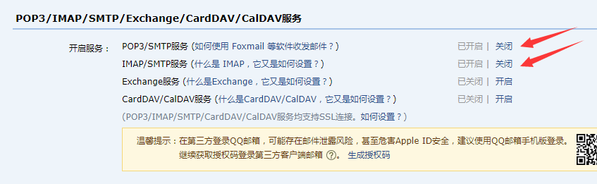

# 邮箱设置

以QQ邮箱为例

1. 注册QQ号，申请QQ邮箱，登陆，随后如图所示进入设置-账户


2. 下翻至如图所示位置，开启POP3/SMTP服务或IMAP/SMTP服务，会得到加密密钥



3. 找到本项目文件中PriceMonitor-mailbox.txt文件，自行设置邮箱，大部分邮箱都支持，比如QQ，gamil，校园邮箱，网易等

- 第一行为发送邮箱地址
- 第二行为发送邮箱密码
- 第三行为邮箱的stmp

QQ邮箱示例：
```
        xxxxxxxxxx@qq.com
        xxxxxxxx
        smtp.qq.com
```

校园邮箱示例：
```
        xxxxxxxxx@xxx.edu.cn  
        xxxxxxxx
        stmp.xxx.edu.cn
```

4.设置成功后，发件邮箱即为此邮箱。

